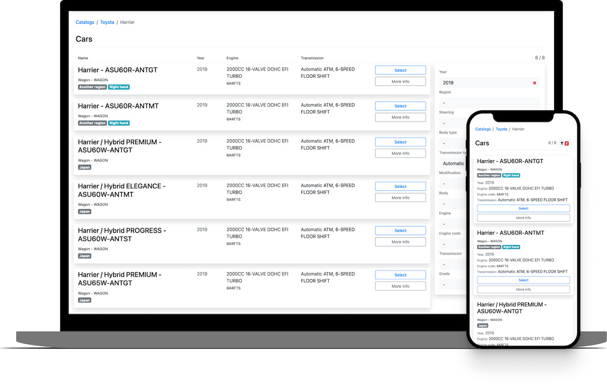

# Disclaimer

This project is provided "as is", without warranty of any kind, express or implied, 
including but not limited to the warranties of merchantability, fitness for a particular purpose, 
and noninfringement. In no event shall the authors or copyright holders be liable for any claim, 
damages, or other liability, whether in an action of contract, tort, or otherwise, arising from, 
out of, or in connection with the software or the use or other dealings in the software.

The authors assume no responsibility for errors or omissions in the information or code provided, 
nor do they warrant or guarantee its functionality or outcomes. Use this code at your own risk and discretion.

Contribution to the project is welcome; however, the authors reserve the right not to implement any changes or 
suggestions that do not align with the project's goals or standards.

# Parts Catalogs Client

Simple client for api.parts-catalogs.com based on PHP Slim framework.



## Install

1. Clone this repo
1. Insert youre api key to [src/settings.php](src/settings.php)
```php
'partsCatalogs' => [
    'apiKey' => 'YOUR_API_KEY_HERE',
]
```
1. Run in docker
   ```docker compose --profile dev up```
1. Open in browser http://127.0.0.1:8080
